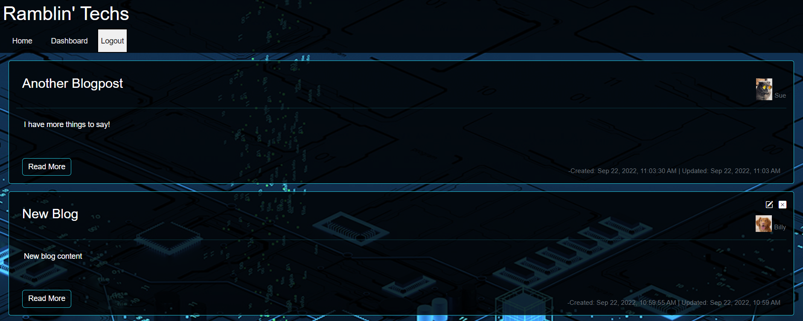
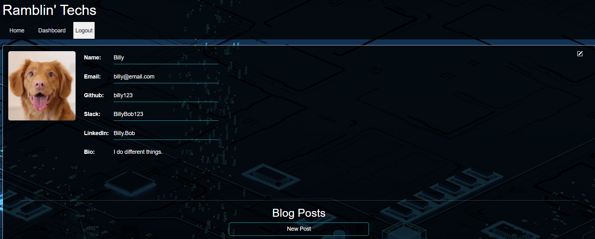
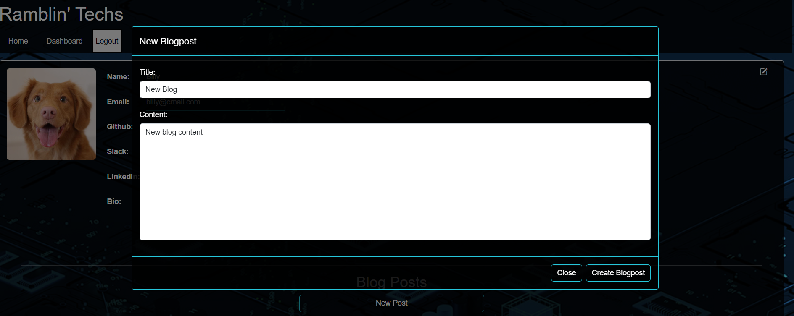
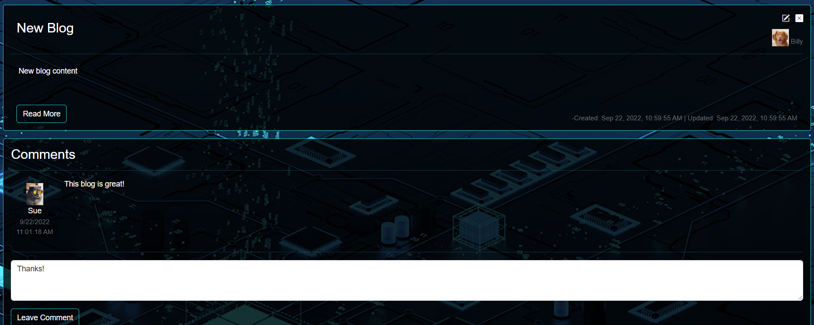

# Ramblin' Techs

## Description

Blog about your favorite developer tools, libraries, frameworks, and more!

## Table of Contents

- 
  - [Description](#description)
  - [Table of Contents](#table-of-contents)
  - [Link](#link)
  - [Usage](#usage)
  - [Images](#images)
    - [Homepage](#homepage)
    - [Profile Page](#profile-page)
    - [Create blog](#create-blog)
    - [Blog Page](#blog-page)
  - [Questions](#questions)
  
## Link
  - [Live App](https://ramblin-techs.herokuapp.com)

## Usage

To use this appliction: 
  1. Click on the link above to go to the live app
  2. Blog away!

## Images

### Homepage

### Dashboard Page

### Create Blog

### Blog Page

## Questions

[My GitHub Profile](https://github.com/Deejerz88)

If you have any questions about my project, please contact me at [djmcmillan93@gmail.com](mailto:djmcmillan93@gmail.com).
